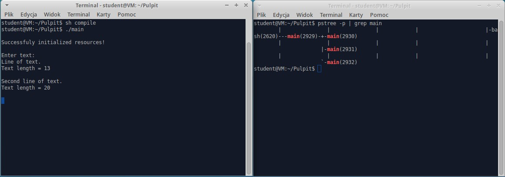
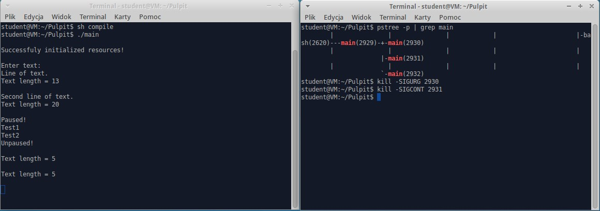
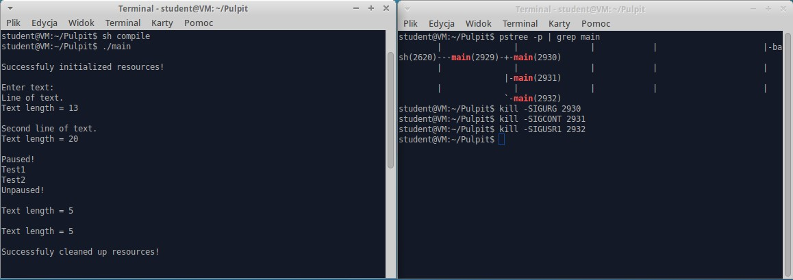

# About
Operating Systems end of term assignment implemented in C99 
using System V semaphores for shared memory access synchronization and
inter-process communication mechanisms such as:
* signals
* named pipes (FIFOs)  

### Given task consists of two parts
I. Implement solution to following producer-consumer problem using System V semaphores  
and shared memory IPC mechanisms:  
Process 1: reads data (one line at a time) from standard input and passes it (unchanged)
to Process 2.  
Process 2: recieves data from Process 2 and passes data length to Process 3.  
Process 3: recieves length of the data from Process 2 and sends it to standard output.  

II. Implement asynchronous communication mechanism (using signals and named pipes) which allows  
user-process and process-process communication.  

User decides to which process signal will be sent and can choose from following signals:
* S1 - exit
* S2 - pause data transfer
* S3 - unpause data transfer  

Process that recieves signal from the user must send S4 signal to other processes that
will inform them to read  
(from named pipe) information about user's action.

# Usage example

# Building the project
Start by cloning the repository with `git clone https://github.com/rafalmaziejuk/ProducerConsumerProject`  
and then run following command `sh compile` to compile.